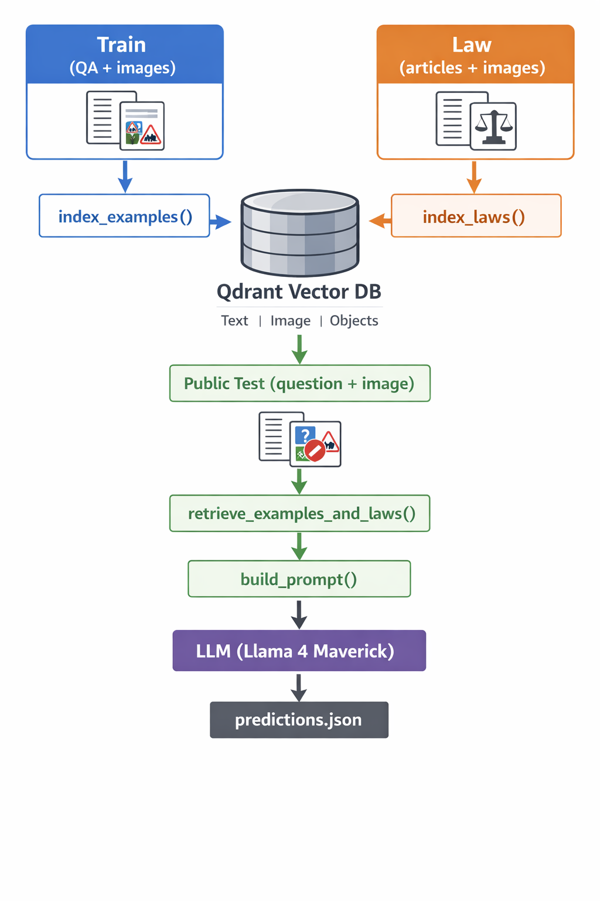

# 🚦 VLSP 2025 - Multimodal Traffic Sign Reasoning (Berry Pipeline)

## I. Giới thiệu

Project này triển khai pipeline theo hướng tiếp cận của team Berry cho bài toán:

VLSP 2025 - Multimodal Legal Question Answering on Traffic Signs

Hệ thống kết hợp:
- Text (câu hỏi + luật)
- Image (ảnh biển báo)
- Object detection (biển trong ảnh)

để truy vấn và suy luận đáp án.

---

## II. Pipeline

---

## 1. Thành phần chính

### 1. Text Embedding
- jina-embeddings-v3

### 2. Image Embedding
- C-RADIOv2-B

### 3. Object Detection
- OWLv2

### 4. Vector Database
- Qdrant

### 5. LLM
- Llama 4 Maverick

---

## 2. Cấu trúc

project/
│
├── berry_pipeline.py
├── evaluate_retrieval.py
├── README.md
├── .env
│
├── dataset/
│   ├── train.json
│   ├── public_test.json
│   ├── train_images/
│   └── public_test_images/
│
├── vlsp2025_law.json

---

## III Cài đặt

pip install -r requirementes.txt

Chạy Qdrant:
docker run -p 6333:6333 qdrant/qdrant

---

--

## IV. Run

python berry_pipeline.py

---

## Output

predictions.json

---

## ** Lưu ý **
- Dùng GPU thì set DEVICE=cuda

---
